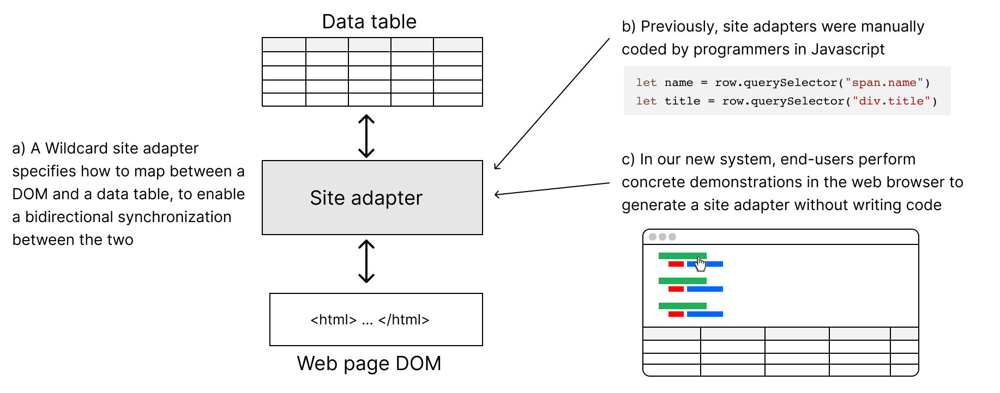
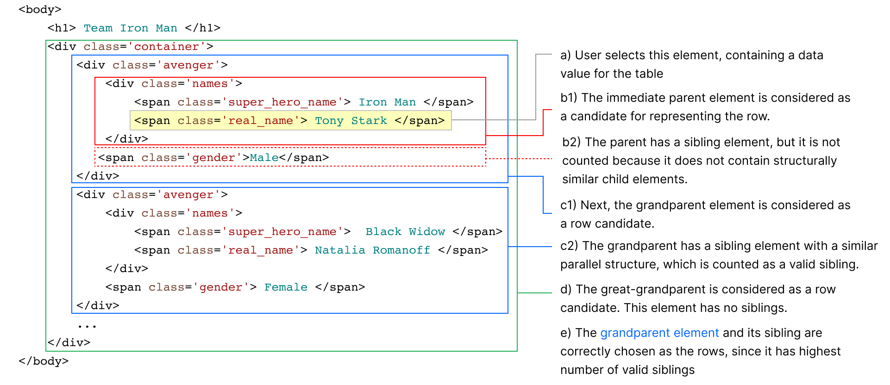

# Introduction {#sec:introduction}

Many websites on the internet do not meet the exact needs of all of their users. End-user web customization systems like Chickenfoot [@bolin2005], Thresher [@hogue2005], Sifter [@huynh2006] and Vegemite [@lin2009] help users tweak and adapt websites to fit their unique requirements, ranging from reorganizing or annotating content on the website to automating common tasks. In our prior work, we presented Wildcard [@litt2020a], a customization system which enables end-users to customize websites through direct manipulation. It does this by augmenting websites with a table view that shows their underlying structured data. The table is bidirectionally synchronized with the original website, so end-users can easily customize the website by interacting with the table, including sorting and filtering data, adding annotations, and running computations in a spreadsheet formula language.

Wildcard has a key limitation. In order to enable end-users to customize a website, a programmer first needs to code a Javascript adapter that specifies how to scrape the website content and set up a bidirectional synchronization with Wildcard's table view. Even though programmers can share adapters with end-users, this means that an end-user can only use Wildcard on websites where some programmer has already written an adapter. Additionally, if an adapter doesn't scrape the desired data, or stops functioning correctly when a website changes, an end-user has no recourse to extend or repair it on their own.

<div class="pdf-only">
\begin{figure*}
  \includegraphics[width=\textwidth]{media/overview.png}
  \caption{\label{fig:overview}Our work enables end-users to create Wildcard site adapters by demonstration.}
\end{figure*}
</div>

In this paper, we describe an addition to Wildcard: a system that enables end-users to create, extend and repair website adapters by demonstration within the browser. Using this scraping system, an end-user can perform web customizations using Wildcard on arbitrary websites, without ever needing to code an adapter. Through a series of examples, we show that our system can create Wildcard adapters on a variety of websites via demonstration ([@sec:demos]). We also describe key aspects of our system and how web scraping for customization leads to a constraint that simplifies the *wrapper induction* [@kushmerick2000] task used to generalize user demonstrations ([@sec:implementation]).

<div class="html-only">
{#fig:overview}
</div>

Our key contribution is a set of three design principles that guided the development of our system, which also offer insights that might be applied to other end-user web scraping and customization tools ([@sec:design-principles]):

- **Unified Environment**: Users should be able to scrape data and interact with the scraped data in a single, unified environment. This minimizes the barrier to fluidly switching back and forth between the two tasks, rather than treating them as entirely independent tasks.
- **Editing By Demonstration**: Users should be able to not only create programs for scraping data by demonstration, but also extend and repair the programs by demonstration. This enables users to build on other users' work, and is especially important in the context of web scraping since scrapers break as the underlying website changes.
- **Live Programming**: Users should receive live feedback as they perform demonstrations. The system should indicate how it is generalizing from the user's example and what the resulting data will look like, so that the user can adjust their demonstrations on the fly and quickly arrive at the desired result.

Finally, we share our broader vision for web scraping for customization, and some opportunities for future work, including a proposal for how Wildcard’s spreadsheet-like formula language might augment demonstrations to provide end-users with more expressiveness in the web scraping process ([@sec:conclusion]).

# Motivating Examples {#sec:demos}

In this section, we show how end-users can create, extend and repair adapters for Wildcard via demonstration.<span class="pdf-only"> These demos are best viewed as videos in the online version of this paper (\url{https://kapaya.github.io/px21}).</span>

## Creating An Adapter

Jen wants to customize her experience on Weather.com by sorting the ten-day forecast based on the description of the weather on each day, allowing her to easily view all the sunny days. She starts the adapter creation process by clicking a context menu item within the Weather.com page, and hovers over a data value she might like to scrape.

<video controls="controls" src="media/2.1.1.mp4" muted playsinline controls class>
</video>

<div class="pdf-only">
\begin{figure*}
  \includegraphics[width=\textwidth]{media/creating.png}
  \caption{\label{fig:creating} Creating an adapter: 1) column data will be scraped into, 2) system's controls, 3) demonstrated column value and row from which columns should be demonstrated from 4) column values determined by generalization algorithm 5) column values populated in table, 6) next column to scrape data into and 7) button to save adapter created by demonstration}
\end{figure*}
</div>

<div class="html-only">
The system provides live feedback as Jen hovers, demonstrating the **live programming** principle:

- The selected row of data is annotated in the page with a border, to indicate that she will be demonstrating values from within that row.
- The selected column of data is highlighted in the page with a green background, to show how the system has generalized her demonstration across all the rows in the data.
- A table view appears at the bottom of the screen, and displays how the values will appear in the data table.

Jen tries hovering over several other elements in the page, taking advantage of the live feedback environment to decide what data would be useful. After considering several options, she decides to save the date field in the first column of the table, and commits the action by clicking.
</div>

<div class="pdf-only">
The system provides live feedback as Jen hovers, demonstrating the **live programming** principle. The workflow steps are shown in @fig:creating:

- The selected row of data is annotated in the page with a border, to indicate that she will be demonstrating values from within that row (Part 3).
- The selected column of data is highlighted in the page with a green background, to show how the system has generalized her demonstration across all the rows in the data (Part 4).
- A table view appears at the bottom of the screen, and displays how the values will appear in the data table (Part 5).

Jen tries hovering over several other elements in the page, taking advantage of the live feedback environment to decide what data would be useful. After considering several options, she decides to save the date field in the first column of the table, and commits the action by clicking.
</div>

<video controls="controls" src="media/2.1.2.mp4" muted playsinline controls class>
</video>

<div class="html-only">
Next, she performs a similar process to fill the next column with the weather descriptions. After filling both columns, she also tries hovering over previously scraped data, and the toolbar at the top of the page indicates which column corresponds to the previously scraped data. Finally, she ends the adapter creation process and is able to immediately sort the forecast by the weather description column, because Wildcard provides a **unified environment** that combines both scraping and customizing.
</div>

<div class="pdf-only">
Next, she performs a similar process to fill the next column with the weather descriptions. After filling both columns, she also tries hovering over previously scraped data, and the toolbar at the top of the page indicates which column corresponds to the previously scraped data. Finally, she ends the adapter creation process (Part 7) and is able to immediately sort the forecast by the weather description column, because Wildcard provides a **unified environment** that combines both scraping and customizing.
</div>

<video controls="controls" src="media/2.1.3.mp4" muted playsinline controls class>
</video>

## Extending An Adapter

Jen has previously used Wildcard to customize timeanddate.com, sorting holidays by day of the week. She comes up with a new customization idea: sorting holidays by category so she can view all the federal holidays together. The current site adapter she is using does not populate the category column in the table, so she needs to extend the adapter. She can immediately perform the extension in the context of the page, using our system's support for **editing by demonstration**.

<div class="pdf-only">
\begin{figure*}
  \includegraphics[width=\textwidth]{media/extending.png}
  \caption{\label{fig:extending} Extending an adapter: 1) table showing current columns and rows, 2) button for initiating adapter extension process, 3) new column value demonstrated and generalized, 4) new column values in the table and 5) button to save adapter extended by demonstration.}
\end{figure*}
</div>

<div class="html-only">
While viewing the website, she clicks the "Edit Adapter" button above the Wildcard table to initiate the adapter editing process. As she hovers over the currently scraped values, the columns they belong to are highlighted. Finally, she clicks on “Federal Holiday” to add the new column of data and saves the changes. Jen then proceeds to sort the list by the type of holiday without the intervention of a programmer.
</div>

<div class="pdf-only">
The workflow is shown in @fig:extending. While viewing the website, she clicks the "Edit Adapter" button (Part 2) above the Wildcard table to initiate the adapter editing process. As she hovers over the currently scraped values, the columns they belong to are highlighted. Finally, she clicks on “Federal Holiday” (Part 3) to add the new column of data to the table (Part 4) and saves the changes (Part 5). Jen then proceeds to sort the list by the type of holiday without the intervention of a programmer.
</div>

<video controls="controls" src="media/2.2.mp4" muted playsinline controls class>
</video>

## Repairing An Adapter

<div class="html-only">
Jen next visits Google Scholar to look up references for her thesis project. Unfortunately, the customization she had applied to sort publications by their title (which is not natively supported by Google Scholar) is no longer working. In fact, the column in the Wildcard table that contained all the publication titles is empty, because the website's internals changed and broke the adapter’s scraping logic. Jen can repair this on her own, again taking advantage of **editing by demonstration**.
</div>

<div class="pdf-only">
Jen next visits Google Scholar to look up references for her thesis project. Unfortunately, the customization she had applied to sort publications by their title (which is not natively supported by Google Scholar) is no longer working. In fact, the column in the Wildcard table that contained all the publication titles is empty, because the website's internals changed and broke the adapter’s scraping logic. Jen can repair this on her own, again taking advantage of **editing by demonstration**.
</div>

<div class="html-only">
Jen initiates the editing process, and initially hovers over the desired value to demonstrate the column she wants to scrape. However, the **live programming** interface indicates to her that the values would be populated into column D; instead, she wants the values to be inserted into column A where they previously appeared. So, Jen clicks on the symbol for column A to indicate that she wants to scrape the values into that column and demonstrates the first publication title. She then proceeds to re-apply her customization to the website by sorting the publications by their title without the intervention of a programmer.
</div>

<div class="pdf-only">
The workflow is shown in @fig:repairing. Jen initiates the editing process (Part 2), and initially hovers over the desired value to demonstrate the column she wants to scrape. However, the **live programming** interface indicates to her that the values would be populated into column D; instead, she wants the values to be inserted into column A where they previously appeared. So, Jen clicks on the symbol for column A (Part 3) to indicate that she wants to scrape the values into that column and demonstrates the first publication title (Part 4). The missing values are now back in the table (Part 5). She then proceeds to save her changes (Part 6) and re-apply her customization to the website by sorting the publications by their title without the intervention of a programmer.
</div>

<video controls="controls" src="media/2.3.mp4" muted playsinline controls class>
</video>

<div class="pdf-only">
\begin{figure*}
  \includegraphics[width=\textwidth]{media/repairing.png}
  \caption{\label{fig:repairing} Repairing an adapter: 1) empty column in table because website changed and adapter can no longer scrape values, 2) button for initiating adapter repair 3) column to scrape data into, 4) missing column value demonstrated and generalized, 5) missing column values back in the table and 6) button to save adapter repaired by demonstration.}
\end{figure*}
</div>

# System Implementation {#sec:implementation}

We implemented our end-user web scraping system as an addition to the Wildcard browser extension. We start by describing our implementations of row and column generalization, live programming, and editing by demonstration, and then discuss some of the current limitations of our system.

## Generalization Algorithms

In order to generate reusable scrapers from user demonstrations, our system solves the *wrapper induction* [@kushmerick2000] task: generalizing from a small set of user-provided examples to a scraping specification that will work on other parts of the website, and on future versions of the website.

We take an approach similar to that used in other tools like Vegemite [@lin2009] and Sifter [@huynh2006]:

- We generate a single *row selector* for the website: a CSS selector that returns a set of Document Object Model (DOM) elements corresponding to individual rows of the table.
- For each column in the table, we generate a *column selector*, a CSS selector that returns the element containing the column value within that row.

One important difference is that our algorithm only accepts row elements that have direct siblings with a similar structure. We refer to this as the *row-sibling* constraint. Later, we describe how the constraint provides a useful simplification of the wrapper induction task and discuss the resulting limitations this puts on our system.

When a user first demonstrates a column value, the generalization algorithm is responsible for turning the demonstration into a row selector that will correctly identify all the row elements in the website and a column selector that will correctly identify the element that contains the column value within a row element. During subsequent demonstrations, the generalization algorithm uses the generated row selector to find the row element that contains the column value and generates a column selector which identifies the corresponding column element.

At a high level, the generalization algorithm’s challenge is to traverse far enough up in the DOM tree from the demonstrated element to find the element which corresponds to the row. We solve this using a heuristic; the basic intuition is to find a large set of elements with similar parallel structure. Consider the following sample HTML layout, which displays a truncated table of superheroes, with each row containing some nested structure:

<div class="pdf-only">
\begin{figure*}
  \includegraphics[width=\textwidth]{media/algorithm.png}
  \caption{\label{fig:algorithm}Our system applies a heuristic to identify DOM elements that correspond to rows in the data table.}
\end{figure*}
</div>

<div class='html-only'>
{#fig:algorithm}
</div>

The user performs a demonstration by clicking on element (a) in @fig:algorithm containing “Tony Stark”. Our algorithm traverses upwards from the demonstrated element, considering each successive parent element ((b1), (c1) and (d) in @fig:algorithm) as a potential candidate for the row element. For each parent element `el`, the process is as follows:

1. compute a column selector `selector` that, when executed on `el`, only returns the demonstrated element
2. for each sibling `el'` of `el`, execute `selector` on `el'` and record whether the selector returns an element. If it does, this suggests that `el'` has some parallel structure to `el`.
3. compute $n_{siblings}$, the number of sibling elements of `el` which have parallel structure.

Notice how the *row-sibling* constraint simplifies the problem. Row candidates without siblings with parallel structure ((b1) in @fig:algorithm) have $n_{siblings}$ = 0, thus disqualifying them.

The algorithm stops traversing upwards once it reaches the BODY element. It chooses the element with the largest positive value of $n_{siblings}$ as the row element, preferring nodes lower in the tree as a tiebreaker. It then generates a _row selector_ which returns the row element and all its direct siblings. The column selector is the selector that traverses from the row element to the demonstrated data value. These row and column selectors are then used to generate a scraping adapter which returns the DOM elements corresponding to a data row in the table and sets up the bidirectional synchronization.

## Live Programming

Live programming is implemented by continually running the generalization algorithm on the DOM element under the user’s cursor, reverting if the user hovers away and committing when the user clicks. The generated row and column selectors are used to highlight all the matching elements on the website and create an adapter. Highlighting all the matching column elements on the website provides visual feedback about the system’s generalization to the user. Creating an adapter enables the system to  populate the table view and set up the bidirectional synchronization. Because the table is populated and the bidirectional synchronization is set up, users can customize as they scrape.

## Editing By Demonstration

Our system generates adapters with the row selector and the column selectors used to scrape the data. The row selector is a CSS selector that identifies all the row elements of the data and the column selectors are CSS selectors that identify each column’s column elements.

When the editing process is initiated, the adapter’s row selector and column selectors are used to highlight the previously scraped values on the website. Furthermore, the generalization algorithm takes the adapter’s row selector and uses it as the basis to generate new column selectors after each demonstration. When a new column is demonstrated, our system appends the generated column selector to the list of column selectors. This is how adapters are extended to create new columns. When an existing column is demonstrated, our system replaces the column’s current column selector with the generated column selector. This is how adapters are repaired to fix broken columns.

Extending and repairing adapters in this manner is feasible because column selectors are independent of each other: changing one column’s selector does not affect another column’s selector. This is not the case for system’s in which the output of demonstrations are dependent on each other. For example, in a web automation sequence that involves clicking on a button to open a menu and then entering text into the menu’s text input, the step that enters the text is not independent because it depends on the step that clicks the button to open the menu.

## Limitations

The row-sibling constraint we mentioned earlier is important for the end goal of customization because row elements that are not direct siblings may not represent data on the website that should be related as part of the same table by customizations such as sorting and filtering. In @fig:limitations we demonstrate two examples where this limitation becomes relevant.

<div class="pdf-only">
\begin{figure*}
  \includegraphics[width=\textwidth]{media/limitations.png}
  \caption{\label{fig:limitations} Two example pages where our generalization algorithm does not currently work. The elements with the blue border correspond to rows of the data and the elements with green borders correspond to tables of data in each layout respectively. For the layout on the left, sorting could lead to rows from one table ending up in the other. For the layout on the right, sorting would lead to a distortion of the table since the column elements cannot be moved as a unit.}
\end{figure*}
</div>

<div class="html-only">
{#fig:limitations}
</div>

*Generalization Limitation 1* shows a case where the data is displayed in a grouped structure. Without the constraint that row elements have to be direct siblings, the row generalization algorithm could determine the row selector to be *.avenger* (elements with blue border) because it matches the largest number of parallel structures (has the largest $n_{siblings}$). While this may be the correct result for the task of extraction, it is not necessarily suitable for the task of customization. When the user sorts and filters, this could result in rows moving between the two tables, disrupting the nested layout and producing a confusing result. Because of this, our system currently does not support such layouts. In the future, we may explore the possibility of extracting multiple tables from a website and joining them together.

*Generalization Limitation 2*, also in @fig:limitations, shows a case where the website contains one table of data in which rows are made up of alternating H1 and SPAN tags (elements with blue border). This poses a challenge because each row does not correspond directly to a single DOM element; instead, each row consists of multiple consecutive DOM elements without any grouped structure. Moving the rows when customizing the webpage would require treating multiple consecutive elements as a single row. This is supported in the underlying Wildcard system, but not yet by our tool.

Our system also does not support scraping data loaded after the initial websites render as the user scrolls. Site adapters hand-coded in Javascript can specify event listeners on the DOM to re-execute the scraping code when new data is loaded as a user scrolls. In future work, we plan to provide a mechanism for end-users to specify when a demonstrated adapter should re-execute its scraping code in response to user scrolling. We also do not support scraping data across multiple pages of related data, but this context poses more fundamental challenges to the idea of web customization, since users would somehow need to perform customizations across multiple pages in coordination.

# Design Principles {#sec:design-principles}

Below, we discuss the three design principles underlying our work and how they relate to the broader field of end-user web scraping and customization.

## Unified Environment

In the previous iteration of Wildcard, web scraping was an entirely separate activity from customization. Programmers that wrote scraping adapters would need to switch into an IDE to write code as part of customizing a new website. This divide between tasks is common in other domains:

- In **data science**, workflows revolve between cleaning and using data but this often happens in different environments. The creators of Wrex [@drosos2020], an end-user programming-by-example system for data wrangling, reported that "although data scientists were aware of and appreciated the productivity benefits of existing data wrangling tools, having to leave their native notebook environment to perform wrangling limited the usefulness of these tools." This was a major reason Wrex was developed as an add-on to Jupyter notebooks, the environment in which data scientists use their data.
- In **web scraping,** if a user comes across an omission while working with data scraped from a website, they need to switch from the environment in which they are using the data to the environment in which they created their scraping code in order to edit and re-run it. This can be seen in many end-user web scraping systems like Rousillon [@chasins2018]and FlashExtract [@le2014] and commercial tools like import.io [@import.io], dexi.io [@dexi.io], Octoparse [@octoparse] and ParseHub [@parsehub].
- In **web customization**, the creators of Vegemite [@lin2009], a system for end-user programming of mashups, reported that participants of its user study thought “it was confusing to use one technique to create the initial table, and another technique to add information to a new column." This hints at the need for both a unified environment and a unified workflow.

In this work, we have combined scraping and customization into a single, unified environment with a unified workflow. The goal is to minimize the environment switch between *extracting* the data and *using* the data. A user might start out by scraping some data on a website, and then switch to customizing the website using the results. Then, they might realize they need more data to perform their desired task, at which point they can easily extend the adapter by demonstrating new columns. All of these tasks take place right in the browser, where the user was initially already using the website. Instead of bringing the data to another tool, we have brought a tool to the data. This principle relates to the idea of “in-place toolchains” [@zotero-1362] for end-user programming systems: that users should be able to program using familiar tools in the context where they already use their software.

Of course, there is value in specialized tools: Wildcard has nowhere near the full capabilities of spreadsheet software or databases. Nevertheless, we believe a single, unified environment for scraping and customization presents a significantly lower barrier to entry for customization.

## Editing By Demonstration

Many end-user web scraping and macro systems allow users to *create* programs by demonstration but do not offer a way to *edit* them by demonstration. In Rousillon [@chasins2018], a web scraping program created by demonstration can only be edited through a high-level, block-based programming language called Helena [@zotero-1349]. Helena supports adding control flow logic (conditional execution, wait times etc) which is invaluable for automating access to websites. However, it does not support extending the web scraping code to add new columns after the demonstration or repairing it to provide new selectors if the website changes. In Vegemite [@lin2009], a web automation program created through demonstration can only be edited by editing the text-based representation of the automation demonstrations. In fact, only the demonstrations used to perform automations on the scraped website data can be edited. If a user needs to add a new column or repair an existing one in the scraped data table, they need to re-demonstrate the columns and then re-run the automation script. One exception to existing editing models worth pointing out is import.io [@import.io]. It allows users to add new columns by demonstration but it is not clear whether deleting a column and re-demonstrating it could serve the purpose of repair.

In the prior iteration of Wildcard, if a website’s hand-coded adapter stops working correctly because the website changes, an end-user’s customizations will often break too. Furthermore, end-users cannot extend the scraping adapter to add columns to the table in order to perform new customizations. This goes against MacLean et. al.'s vision of user-tailorable systems [@maclean1990] that give users "a feeling of ownership of the system, to feel in control of changing the system and to understand what can be changed." Providing an easy way for users to edit programs is therefore fundamental to fully democratizing web customization.

Editing by demonstration makes end-users first-class citizens in the customization ecosystem. Because users interact with the scraped data through a unified environment directly in the context of the website, it is easy to initiate the scraping system in editing mode: the scraping system is simply booted up using metadata stored with the scraping adapter to the state when the demonstration was completed. Users that have gone through the creation process will immediately realize what to do in order to extend or repair the adapter. Users that have not gone through the creation process might have a harder time but we provide visual clues (such as highlighting the row to perform demonstrations from with a green border) and live programming (immediately preview the results of demonstrations) that serve as guides.

As discussed in [@sec:implementation], editing by demonstration in the web scraping domain is feasible because column selectors are independent of each other. However, this is not the case with row selectors because column selectors are dependent on them. Our system therefore does not support editing rows but this an acceptable limitation given our focus on extension and repair which only involve column selectors.

## Live Programming

In many programming-by-demonstration web scraping systems [@chasins2018; @lin2009], users only get *full* feedback about the program’s execution (generalization and the scraped values) after providing *all* the demonstrations. This means they cannot adjust their demonstrations in response to the system’s feedback as they demonstrate.

Our end-user web scraping system employs live programming techniques to eliminate this edit-compile-debug cycle by running the generalization algorithm and generating an adapter after each user demonstration. As we showed in [@sec:demos], when a user demonstrates a value of a column they wish to scrape, our system immediately shows how it has generalized the user’s demonstration across the other rows of the data by highlighting the all relevant values. It also populates the table with the scraped data based on the latest demonstration. The highlighting and table population serve to give users a view of how their demonstration has been generalized and what data will be available in the table once scraped.

Many successful end-user programming systems such as spreadsheets and SQL provide users with immediate results after entering commands. Our live programming environment is particularly similar to that of FlashProg [@mayer2015], a framework that provides user interface support for programming-by-demonstration systems like FlashExtract [@le2014], and relates to the idea that an important quality of end-user programming is “interaction with a living system” [@zotero-1362].

Unlike text-based commands which are only valid once complete (e.g ```SELECT * FRO``` versus ```SELECT * FROM user_table```), the target of  demonstration commands (the value of a DOM element under the cursor) is the same during both hover and click. This allows us to execute a command before a user completes it, thereby providing them with a preview of the results on hover.

There are limits to this approach. Providing live feedback on websites with a large number of DOM elements or complex CSS selectors can slow down the generalization process, especially if a user is constantly moving their cursor. Furthermore, many datasets are too large to preview in the table in their entirety; the user might benefit more from the live feedback if it could summarize large datasets. For example, FlashProg provides a summary of the generalization through a color-coded minimap next to the scrollbar of its extraction interface.

# Related Work {#sec:related-work}

End-user web scraping for customization relates to existing work in end-user web scraping and end-user web customization by a number of tools.

## End-user Web Scraping

FlashProg [@mayer2015] is a framework that provides user interface support for FlashExtract [@le2014], a framework for data scraping by examples. FlashProg's interface provides immediate visual feedback about the generalization and scrapes the matched values into an output tab. In addition, it has a program viewer tab that contains a high level description of what the generated program is doing and provides a list of alternative programs. Finally, it has a disambiguation tab that utilizes conversational clarification to disambiguate programs, the conservations with the user serving as inputs to generate better programs. Though FlashProg has many desirable features we aim to implement in future iterations, its implementation does not align with our goal to provide a unified environment within a browser for scraping and customizing websites.

Rousillon [@chasins2018] is a tool that enables end-users to scrape distributed, hierarchical web data. Because demonstrations can span across several websites and involve complex data access automation tasks, its interface does not provide *full* live feedback about its generalizations or the values to be scraped until all the demonstrations have been provided and the generated program has been run. If run on a website it has encountered before, Rousillon makes all the previously determined generalizations visible to the user by color-coding the values on the website that belong to the same column. This is a desirable feature for our system as users will not have to actively explore in order to discover which values are available for scraping and how they are related to each other. On the extension and repair front, Rousillon presents the web scraping code generated by demonstration as an editable, high-level, block-based language called Helena [@zotero-1349]. While Helena can be used to perform more complex editing tasks like adding control flow, it does not support adding or repairing columns after the demonstrations and presents a change in the model used for creation. Our system maintains the model used for creation by allowing users to extend and repair web scraping code via demonstration.

## End-user Web Customization

Vegemite [@lin2009] is a tool for end-user programming of mashups. It has two interfaces: one for scraping values from a website and another for creating scripts that operate on the scraped values. The web scraping interface does not provide live feedback about the generalization on hover but after a user clicks a value, the interface shows the result of the system’s generalization by highlighting the all matched values. Furthermore, even though the interface also has a table, the table is only populated with the scraped values after all the demonstrations have been provided. The scripting interface utilizes CoScripter [@leshed2008] which is used to record operations on the scraped values for automation. For example, the scripting interface can be used to demonstrate the task of copying an address in the table, pasting it into a walk score calculator and pasting the result back into the table. The script would then be generalized to all the rows and re-run to fill in the remaining walk scores. CoScripter provides the generated automation program as text-based commands, such as “paste address into ‘Walk Score’ input”, which can be edited after the program is created via “sloppy programming” [@lin2009] techniques. However, this editing does not extend to the web scraping interface used for demonstrations and presents a change in the model used for creation.

Sifter [@huynh2006] is a tool that augments websites with advanced sorting and filtering functionality. Similarly to Wildcard, it uses web scraping techniques to extract data from websites in order to enable customizations. However, Wildcard supports a broader range of customizations beyond sorting and filtering, including adding annotations to websites and running computations with a spreadsheet formula language. Our scraping tool intentionally provides less automation than Sifter. Sifter attempts to automatically detect items and fields on the page with a variety of clever heuristics, including automatically detecting link tags and considering the size of elements on the page. It then gives the user the option of correcting the result if the heuristics do not work properly. In contrast, our heuristics are simpler and make fewer assumptions about the structure of websites. Rather, we give more control to the user from the beginning of the process, and incorporate live feedback to help the user provide useful demonstrations. We hypothesize that focusing on a tight feedback loop rather than automation may support a scraping process that is just as fast as an automated one, but gives the user finer control and extends to a greater variety of websites where more complex heuristics do not apply. However, further user testing is required to actually validate this hypothesis.

# Conclusion And Future Work {#sec:conclusion}

In this paper, we presented our progress towards *end-user web scraping for customization*,  to empower end-users in Wildcard’s ecosystem to create, extend and repair scraping adapters. There are several outstanding issues and open questions we hope to address in future work.

Like existing programming-by-demonstration approaches, web scraping in our current implementation is limited to what can be demonstrated. This is problematic if users want to scrape the URL associated with a link element, which is not visible, or only scrape a substring of a value. To solve this, we plan to harness Wildcard’s formula language. End-users will be able to use formulas targeted at web scraping to access DOM element properties and attributes. For example, a formula like ```=GetAttribute(link_column, ‘href’)``` could be used to scrape URLs of link elements. End-users will also be able to use formulas targeted at data processing. For example, a formula like ```=GetSubstring(name_column, 1, 2)``` could be used to scrape substrings of text values. Such web scraping and data processing formulas will give end-users some of the power available to programmers that write web scraping code in Javascript which supports a wide variety of DOM access and processing ability.

To assess our design principles, we plan to carry out a broader evaluation of our system through a user study. So far, we have only tested the system amongst ourselves and a small number of colleagues. More testing is needed to understand whether it can be successfully used among a broader set of users across a wider variety of websites. Furthermore, we plan to incorporate the program viewer and disambiguation features of FlashProg [@mayer2015] to give users more insight and control into the generalization process.

Our end goal is to empower end-users to customize websites in an intuitive and flexible way, and thus make the web more malleable  for all of its users.
